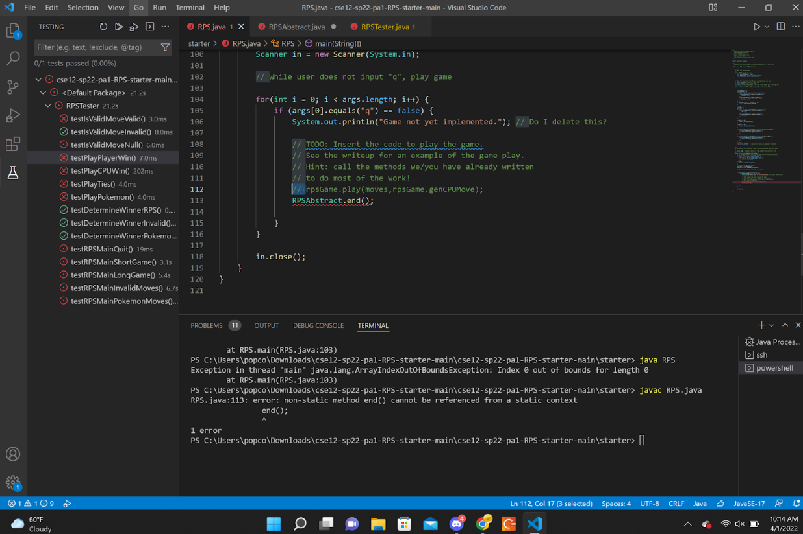
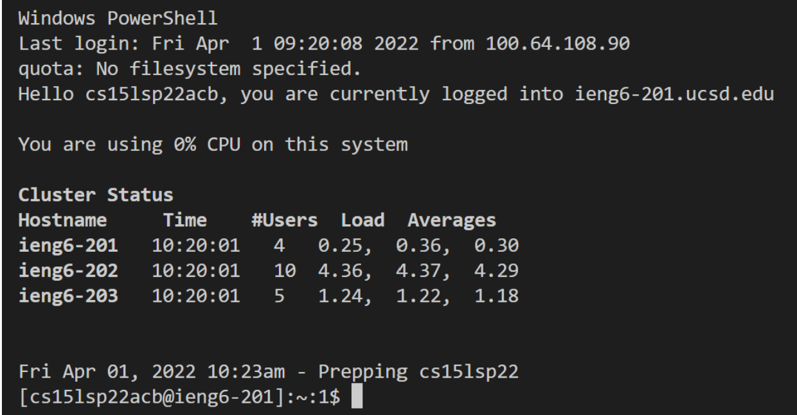
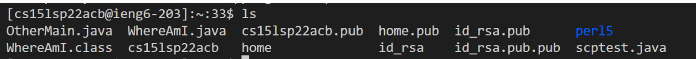
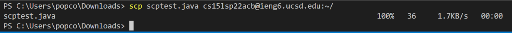
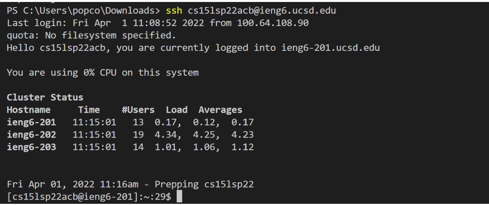
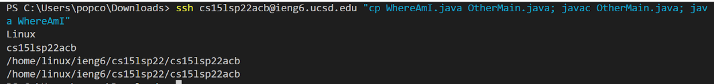

# Installing VScode

For this step, I googled VScode. From there, I installed it for my operating system and took a screenshot.

[Link to install VS Code](https://code.visualstudio.com/download)

[Link to help setup VS Code](https://code.visualstudio.com/docs/setup/setup-overview)

# Remotely Connecting
After finding your cse15l account, use "ssh YourAccount" to log in remotely. It will then prompt for your password which you should have reset. Below is what it will look like once you're logged in.

'''
ssh cs15lsp22acb@ieng6.ucsd.edu
'''

# Trying Some Commands
You should try out some commands once logged in. Below is an example of when I used ls which gave me the directory. 

'ls'

# Moving Files with scp
After making a file in java, upload it using "scp FileName.java". Below is what it should look like if used correctly. It even gives statistics on the upload.

'scp scptest.java'

# Setting an SSH Key
To set an SSH key, enter "ssh-keygen" then "scp /Users/<user-name>/.ssh/id_rsa.pub cs15lsp22zz@ieng6.ucsd.edu:~/.ssh/authorized_keys". You should now be able to login without using a password like I did below.
  
'ssh-keygen /Users/<user-name>/.ssh/id_rsa.pub cs15lsp22zz@ieng6.ucsd.edu:~/.ssh/authorized_keys'
  

# Optimizing Remote Running
Now attempt to run commands in the server with as little clicks as possible. The screenshot below shows I made a local edit to a file, copied it to a remote server, then ran the file. It took 3 keys (copy, paste, and enter) in total.

