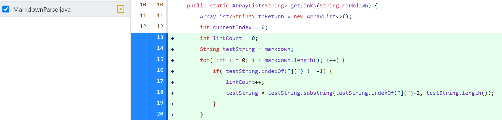

# First code change
Here's the code change I made:


Here's a link to the test file that caused me to make this change:
https://github.com/NickAzp/cse15l-lab-reports/blob/main/test-file-copy.md

Here's the output of the failure inducing input. In the first link, there's a parentheses in the middle of the link which causes the code to mess up for it.:
```
javac MarkdownParse.java
java MarkdownParse test-file-copy.md
```

