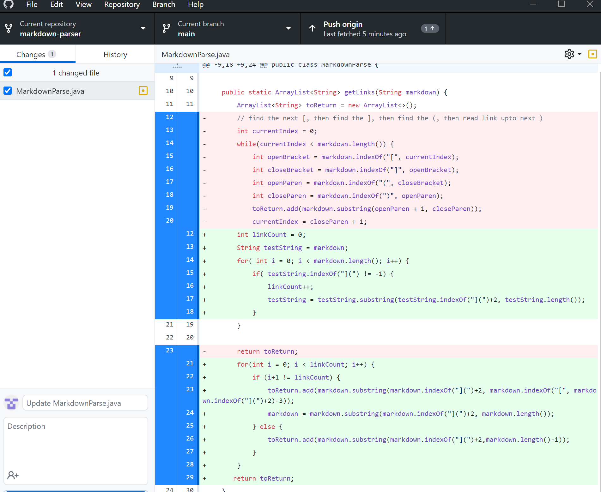
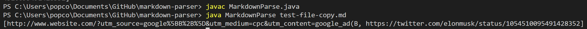
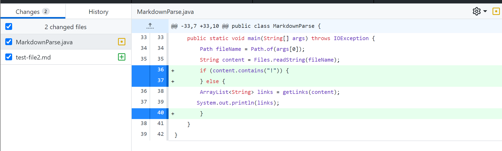
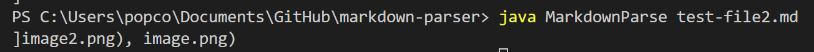
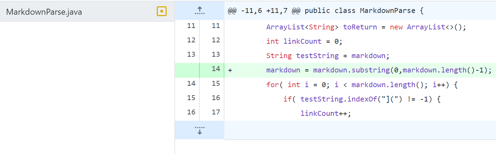
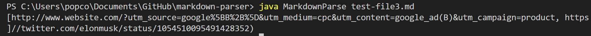

# First code change
Here's the code change I made:

Here's a link to the test file that caused me to make this change:
https://github.com/NickAzp/cse15l-lab-reports/blob/main/test-file-copy.md

Here's the output of the failure inducing input. In the first link, there's a parentheses in the middle of the link which causes the code to mess up for it:

The bug is that the original code used the indexing of the parentheses to determine the links. However, a symptom of the bug was that it caused incorrect indexes for the links and therefore an incorrect output if a link with parentheses was used for the test.

# Second code change
Here's the code change I made:

Here's a link to the test file that caused me to make this change:
https://github.com/NickAzp/cse15l-lab-reports/blob/main/test-file2.md

Here's the output of the failure inducing input. Since it's an image link, it should not be printed out:

The bug is that 
# Third Code Change
Here's the code change I made:

Here's a link to the test file that caused me to make this change:
https://github.com/NickAzp/cse15l-lab-reports/blob/main/test-file3.md

Here's the output of the failure inducing input. The extra space messes up the indexing on the code which causes the output to be incorrect:

