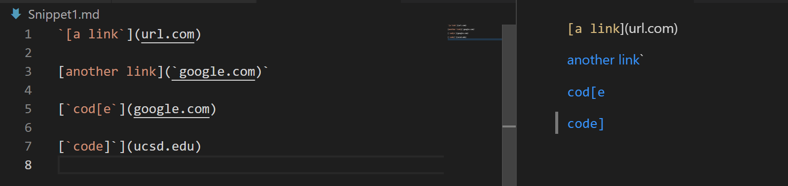
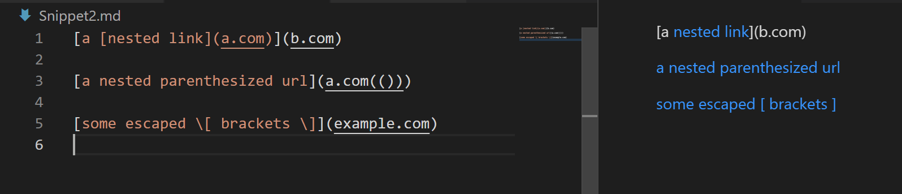
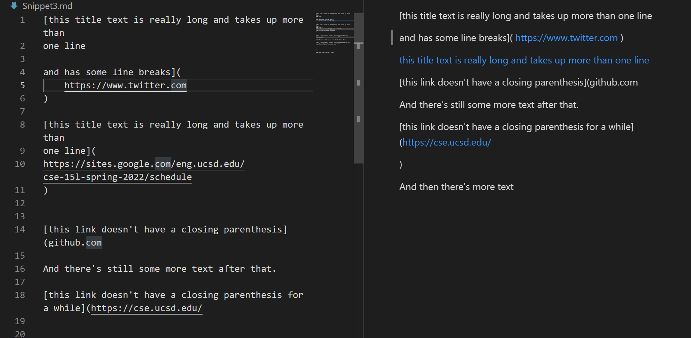

Link to my markdown-parse repository: 

https://github.com/NickAzp/markdown-parser

Link to the one I reviewed in week 7:

https://github.com/lithicarus/markdown-parser

What each tests should produce based on https://spec.commonmark.org/dingus/ :

  Snippet 1:
  
  
  
  [a link](url.com)

  another link`

  cod[e

  code]
  
  Snippet 2:
  
  
  
  [a nested link](b.com)

  a nested parenthesized url

  some escaped [ brackets ]
  
  Snippet 3:
  
  
  
  [this title text is really long and takes up more than one line

  and has some line breaks]( https://www.twitter.com )

  this title text is really long and takes up more than one line

  [this link doesn't have a closing parenthesis](github.com

  And there's still some more text after that.

  [this link doesn't have a closing parenthesis for a while](https://cse.ucsd.edu/

  )

  And then there's more text
  
 
