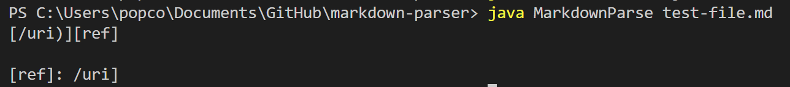

# Test 1

### How I found the test with different results

I found this test through manually searching and finding a test that I think my code did not account for. In this case, it was not accounting for slashes in the link.

### Link to the test-file with different results

https://github.com/nidhidhamnani/markdown-parser/edit/main/test-files/509.md

### Expected output

Should be [title]

### My implementation output

### Implementation for week 9 output

### Correctness of implementation

Both implementations are incorrect.

### If implementation(s) have bug. Description of bug in 2-3 sentences with screenshot of where code needs to be fixed.

# Test 2

### How I found the test with different results

I found this test through manually searching and finding a test that I think my code did not account for. In this case, it was the extra brackets in the file that I think may have caused an error.

### Link to the test-file with different results

https://github.com/nidhidhamnani/markdown-parser/edit/main/test-files/531.md

### Expected output

Should be [/url, /url]

### My implementation output

### Implementation for week 9 output

### Correctness of implementation

Both implementations are incorrect.

### If implementation(s) have bug. Description of bug in 2-3 sentences with screenshot of where code needs to be fixed.

